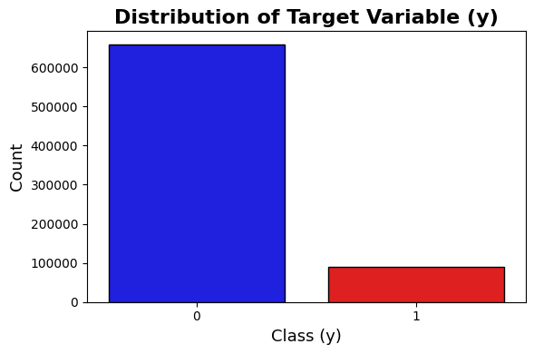
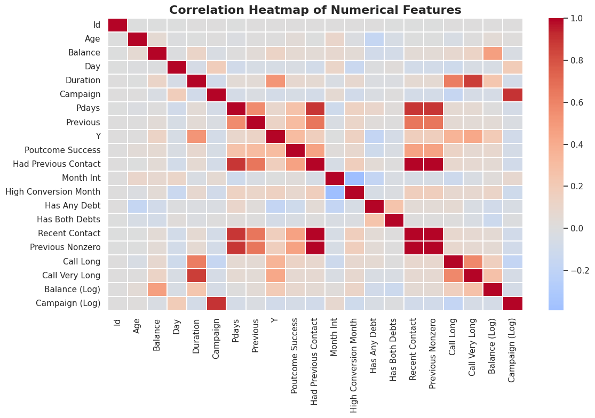
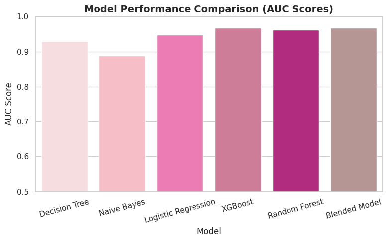
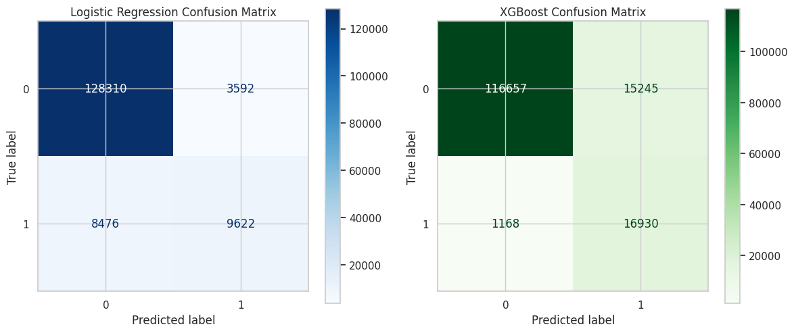
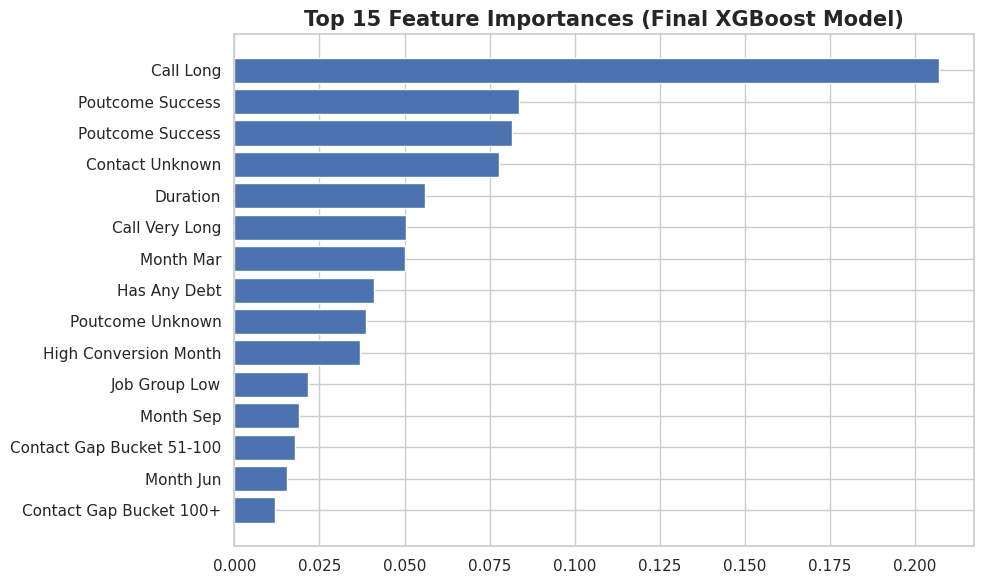
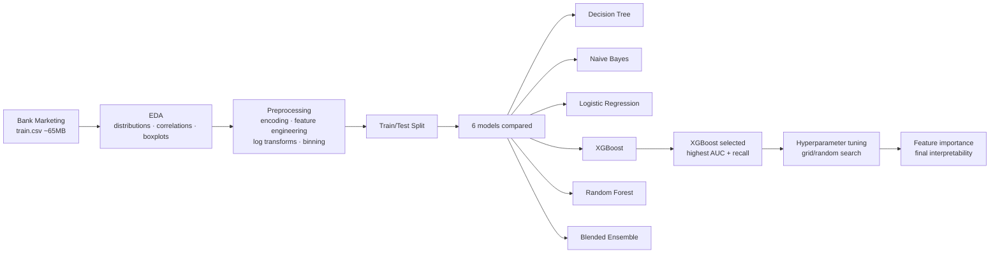

# ML Customer Prediction

End-to-end binary classification project predicting customer subscription
behavior on a bank-marketing dataset. EDA, preprocessing, six-model bake-off,
hyperparameter tuning, and SHAP-style feature importance — built for an MSBA
Machine Learning class with a research-poster deliverable.

## Preview

All charts below are **real outputs from this notebook** (extracted from the
notebook's saved cell outputs).

| | |
|:---:|:---:|
|  |  |
| **Class imbalance:** the target is heavily skewed toward 0 (~660k vs ~90k) — the kind of imbalance that punishes naïve accuracy and motivates AUC + recall as the right metrics. | **Correlation heatmap:** dense block around `Pdays / Previous / Recent Contact / Previous Nonzero` flags multicollinearity in the contact-history features; informed downstream feature selection. |



Six models compared on AUC. **XGBoost** and the blended ensemble tied at the
top (~0.97); Random Forest close behind (~0.96); Naive Bayes the floor (~0.89).
XGBoost was chosen for the final model on AUC + recall.



Confusion matrices on the held-out test set. Both models hit very high true-negative
rates, but **XGBoost lifts recall on the positive class from ~53% (logistic) to
~94%** — the part that actually matters for a sales-targeting model where the
business cost is missing real subscribers, not over-contacting.



Top features in the final XGBoost: **Call Long** dominates, with **Poutcome
Success**, **Contact Unknown**, and **Duration** rounding out the top tier.
Engineered "Has Any Debt" and the seasonal month indicators (Mar, Sep, Jun)
made the cut alongside raw features.

## How It Works



**Notebook organization** (Final_Code.ipynb):

| Section | Cells | What it does |
| --- | --- | --- |
| Import packages | 1–4 | xgboost, shap, sklearn, pregress |
| Data Understanding & EDA | 5–18 | distribution of target, age, duration; scatter age vs balance; correlation heatmap; boxplots |
| Preprocessing | 19–28 | encoding, feature engineering (Call Long, Has Any Debt, High Conversion Month, log transforms, contact-gap buckets) |
| Hyperparameter tuning | 29–32 | grid over XGBoost params with held-out validation |
| Model comparison | 33–40 | confusion matrices + AUC across 6 models |
| Final model + interpretability | 41–53 | refit best model; feature importance with named features |

## Data

This project trains on a bank-marketing-style dataset with engineered features
including `Call Long`, `Poutcome Success`, `Contact Unknown`, `Duration`,
seasonal indicators, and contact-history aggregates. The original `train.csv`
(~65 MB) and `test.csv` (~21 MB) are not committed — place them in the repo
root before running.

## Tech Stack

- **Python 3.10+**
- `pandas`, `numpy` — data handling
- `xgboost` — gradient boosting (final model)
- `scikit-learn` — preprocessing, metrics, train/test split, baseline models
- `shap` — feature importance & explainability
- `pregress` — regression utility
- `matplotlib`, `seaborn` — visualization

## Run It

```bash
pip install -r requirements.txt
jupyter notebook Final_Code.ipynb
```

### Note: originally developed in Google Colab

The notebooks include `from google.colab import files` and use Colab's
file-upload widget for the input CSVs. To run locally, replace any
`files.upload()` calls with `pd.read_csv("train.csv")` after placing the data
in the repo root.

## Files

| File | What it is |
| --- | --- |
| `Final_Code.ipynb` | Full development notebook — EDA, preprocessing, 6-model bake-off, tuning, final XGBoost + interpretability |
| `FinalPosterCodeWithLabels.ipynb` | Cleaned-up version with labeled outputs used for the research poster figures |
| `Customer Prediction Classification-2.png` | Final research poster |
| `screenshots/` | PNG previews referenced in this README (extracted from notebook outputs) |
| `requirements.txt` | Pinned dependencies |

## License

[MIT](LICENSE)
